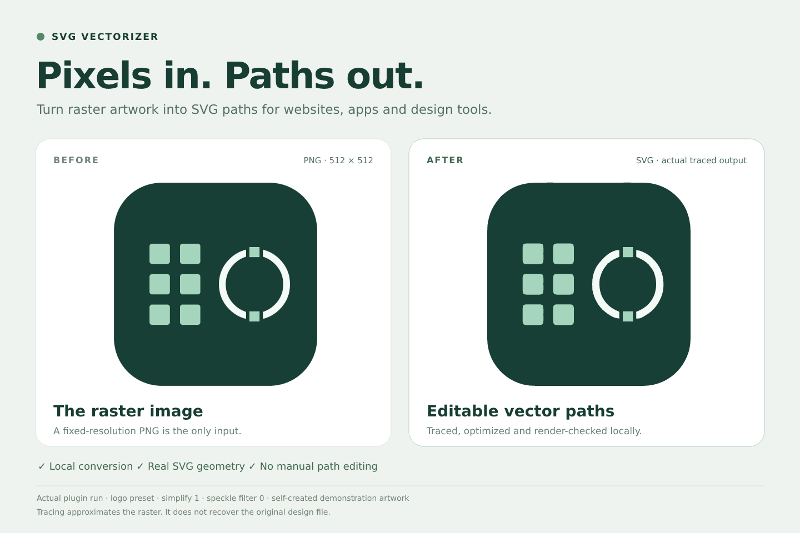

# A real PNG-to-SVG example



The left panel is `demo-input.png`, a 512 × 512 raster made from this project's own
simple logo artwork. The right panel is the actual `demo-output.svg` generated by
the plugin. No paths were manually redrawn after conversion.

The comparison image is a presentation of those two files, not a separate tracing
result. This example demonstrates the workflow, not recovery of an original design
or a claim that SVG will always be smaller or visually identical.

## Reproduce

From the plugin root after installing dependencies:

```bash
node examples/render-demo.mjs input
.venv/bin/python scripts/vectorize.py examples/demo-input.png -o examples/demo-output.svg --preset logo --simplify 1 --filter-speckle 0
node examples/render-demo.mjs preview
```

On Windows, use `.venv\Scripts\python.exe` for the Python command.
`render-demo.mjs` renders the source fixture and assembles the comparison plate; only
`vectorize.py` creates the traced geometry. The PNG comparison uses a system font
(DejaVu Sans when available), so text rendering can vary by machine.

The authored source icon and demo files are covered by this project's MIT license.
